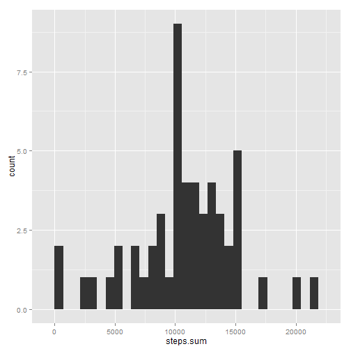
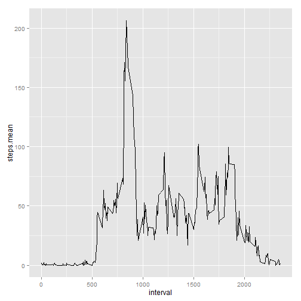
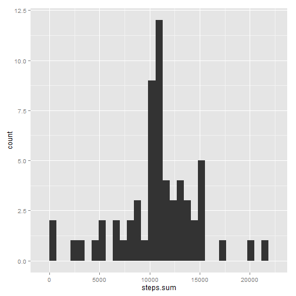
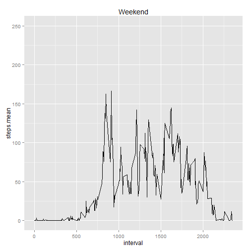
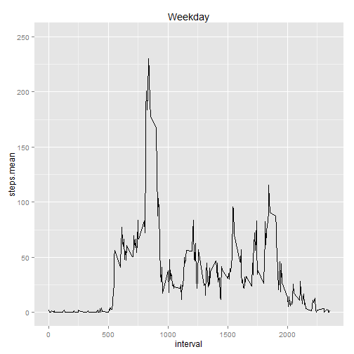
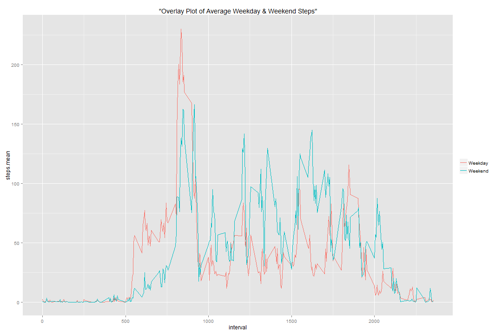

```r
knitr::opts_chunk$set(echo=T, warnings = F, message = F)
library(dplyr)
library(ggplot2)
library(doBy)
library(chron)
#library(cowplot)
```

---
# Loading and Processing Data

```r
  inDataOrig <- read.csv("activity.csv")
  
  # Setting main DF variable to contain only complete cases
  inData <- inDataOrig[complete.cases(inDataOrig),]
  
  # Creating a data frame with no NAs or invervals with 0 (zero) steps
  inDataNoZeros <- inData[inData$steps > 0,]
```


Also there is an additional 11014 cases/records were there there are 0 (zero) 'steps' for a given 'interval'. A seperate data frame is created to operate on where the number of steps taken per interval is greater than zero.

# Mean Total Number of Steps Taken Per Day

```r
  # Summarizing the data set to a single data frame with mean, median, and total number of steps per day.
  dataSummary <- summaryBy(steps ~ date, data = inData, FUN = list(mean, median, sum))
  
  # Total number of steps per day histogram
  qplot(steps.sum, data=dataSummary, geom = "histogram")
```

 

The list below shows a table of the meand and median steps per day.  
*Please note:* 
Every day of measurement, the number of intervals that contained zero steps was greater than 50%. Because of that every record in the "steps.median" column is zero.
Per the TA's instruction, zero value intervals are to be factored in all calculations. [Link to TA's instruction](https://class.coursera.org/repdata-032/forum/thread?thread_id=69#comment-164)  


```r
  print.data.frame(dataSummary[,-4], row.names = F)
```

```
##        date steps.mean steps.median
##  2012-10-02  0.4375000            0
##  2012-10-03 39.4166667            0
##  2012-10-04 42.0694444            0
##  2012-10-05 46.1597222            0
##  2012-10-06 53.5416667            0
##  2012-10-07 38.2465278            0
##  2012-10-09 44.4826389            0
##  2012-10-10 34.3750000            0
##  2012-10-11 35.7777778            0
##  2012-10-12 60.3541667            0
##  2012-10-13 43.1458333            0
##  2012-10-14 52.4236111            0
##  2012-10-15 35.2048611            0
##  2012-10-16 52.3750000            0
##  2012-10-17 46.7083333            0
##  2012-10-18 34.9166667            0
##  2012-10-19 41.0729167            0
##  2012-10-20 36.0937500            0
##  2012-10-21 30.6284722            0
##  2012-10-22 46.7361111            0
##  2012-10-23 30.9652778            0
##  2012-10-24 29.0104167            0
##  2012-10-25  8.6527778            0
##  2012-10-26 23.5347222            0
##  2012-10-27 35.1354167            0
##  2012-10-28 39.7847222            0
##  2012-10-29 17.4236111            0
##  2012-10-30 34.0937500            0
##  2012-10-31 53.5208333            0
##  2012-11-02 36.8055556            0
##  2012-11-03 36.7048611            0
##  2012-11-05 36.2465278            0
##  2012-11-06 28.9375000            0
##  2012-11-07 44.7326389            0
##  2012-11-08 11.1770833            0
##  2012-11-11 43.7777778            0
##  2012-11-12 37.3784722            0
##  2012-11-13 25.4722222            0
##  2012-11-15  0.1423611            0
##  2012-11-16 18.8923611            0
##  2012-11-17 49.7881944            0
##  2012-11-18 52.4652778            0
##  2012-11-19 30.6979167            0
##  2012-11-20 15.5277778            0
##  2012-11-21 44.3993056            0
##  2012-11-22 70.9270833            0
##  2012-11-23 73.5902778            0
##  2012-11-24 50.2708333            0
##  2012-11-25 41.0902778            0
##  2012-11-26 38.7569444            0
##  2012-11-27 47.3819444            0
##  2012-11-28 35.3576389            0
##  2012-11-29 24.4687500            0
```

# Average Daily Pattern

```r
  # 5 minute intervals averaged across all days
  intervalAvg <- summaryBy(steps ~ interval, data = inData[,c(1,3)], FUN=mean)
  ggplot(data=intervalAvg, aes(x=interval, y=steps.mean)) + geom_line()
```

 

The following interval contained the greatest number of steps across all days measured:

```r
  print.data.frame(intervalAvg[intervalAvg$steps.mean == max(intervalAvg$steps.mean),], row.names = F)
```

```
##  interval steps.mean
##       835   206.1698
```

# Imputing Missing Values
A total of 2304 incomplete cases/records exist in the original data set which represents 8 days (about 13%) of missing data out of the 61 potentially observal days in the original data set.  
  
The strategy that's going to be used to fill in those missing (NA) values (for a given day), is going to be the to swap out all NAs with the calculated average number of steps for that interval. The justification for this is that there some days in which the entire day is filled with NA values. For example, if the calculated average number of steps for inverval "1565" is '56.2', then all NAs will be replaced by the average '56.2'.  
This WILL have an effect on both mean and median values for all dates in the data set.

```r
  # Making copt in to new data frame
  inDataFull <- inDataOrig
  
  # Matching all NA rows to rows in 'intervalAvg' by interval value
  t1 <- merge(inDataFull[is.na(inDataFull$steps),], intervalAvg, by="interval")
  
  # Rearranging by date then interval
  t1 <- arrange(t1, date, interval) 
  
  # Rearranding columns and removing one non-needed column
  t1 <- t1[,c(4,3,1)]
  
  # Replaving all NA values with interval average.
  inDataFull[is.na(inDataFull$steps), "steps"] <- t1$steps.mean
  rm(t1) # Removing temporary veriable from memory
  
  # Summarizing data by mean, median, and total
  dataFullSummary <- summaryBy(steps ~ date, data = inDataFull, FUN = list(mean, median, sum))
```

The histogram below contains the previously ommited incomplete cases. The graph doesn't change much because there were only 8 days out of the 61 days (about 13%) recorded which didn't contain any data. 

```r
  # Total number of steps per day histogram
  qplot(steps.sum, data=dataFullSummary, geom = "histogram")
```

 

Below is the updated mean and median values. Day's which were previously ommited to being filled with NA values are now shown below. Days in which there were no NA values were not effected.   

```r
  # Printing data frame with mean and median steps per day
  print.data.frame(dataFullSummary[,c(1:3)], row.names = F)
```

```
##        date steps.mean steps.median
##  2012-10-01 37.3825996     34.11321
##  2012-10-02  0.4375000      0.00000
##  2012-10-03 39.4166667      0.00000
##  2012-10-04 42.0694444      0.00000
##  2012-10-05 46.1597222      0.00000
##  2012-10-06 53.5416667      0.00000
##  2012-10-07 38.2465278      0.00000
##  2012-10-08 37.3825996     34.11321
##  2012-10-09 44.4826389      0.00000
##  2012-10-10 34.3750000      0.00000
##  2012-10-11 35.7777778      0.00000
##  2012-10-12 60.3541667      0.00000
##  2012-10-13 43.1458333      0.00000
##  2012-10-14 52.4236111      0.00000
##  2012-10-15 35.2048611      0.00000
##  2012-10-16 52.3750000      0.00000
##  2012-10-17 46.7083333      0.00000
##  2012-10-18 34.9166667      0.00000
##  2012-10-19 41.0729167      0.00000
##  2012-10-20 36.0937500      0.00000
##  2012-10-21 30.6284722      0.00000
##  2012-10-22 46.7361111      0.00000
##  2012-10-23 30.9652778      0.00000
##  2012-10-24 29.0104167      0.00000
##  2012-10-25  8.6527778      0.00000
##  2012-10-26 23.5347222      0.00000
##  2012-10-27 35.1354167      0.00000
##  2012-10-28 39.7847222      0.00000
##  2012-10-29 17.4236111      0.00000
##  2012-10-30 34.0937500      0.00000
##  2012-10-31 53.5208333      0.00000
##  2012-11-01 37.3825996     34.11321
##  2012-11-02 36.8055556      0.00000
##  2012-11-03 36.7048611      0.00000
##  2012-11-04 37.3825996     34.11321
##  2012-11-05 36.2465278      0.00000
##  2012-11-06 28.9375000      0.00000
##  2012-11-07 44.7326389      0.00000
##  2012-11-08 11.1770833      0.00000
##  2012-11-09 37.3825996     34.11321
##  2012-11-10 37.3825996     34.11321
##  2012-11-11 43.7777778      0.00000
##  2012-11-12 37.3784722      0.00000
##  2012-11-13 25.4722222      0.00000
##  2012-11-14 37.3825996     34.11321
##  2012-11-15  0.1423611      0.00000
##  2012-11-16 18.8923611      0.00000
##  2012-11-17 49.7881944      0.00000
##  2012-11-18 52.4652778      0.00000
##  2012-11-19 30.6979167      0.00000
##  2012-11-20 15.5277778      0.00000
##  2012-11-21 44.3993056      0.00000
##  2012-11-22 70.9270833      0.00000
##  2012-11-23 73.5902778      0.00000
##  2012-11-24 50.2708333      0.00000
##  2012-11-25 41.0902778      0.00000
##  2012-11-26 38.7569444      0.00000
##  2012-11-27 47.3819444      0.00000
##  2012-11-28 35.3576389      0.00000
##  2012-11-29 24.4687500      0.00000
##  2012-11-30 37.3825996     34.11321
```

# Differences in Activity Patterns Between Weekday and Weekend

```r
  #
  dayOrEnd <- function(x){
    if (is.weekend(as.Date(x))){
      return("weekend")
    }else{
      return("weekday")
    }
  }
  
  inDataFull$weekDayOrEnd <- apply(inDataFull["date"], MARGIN = 1, FUN = dayOrEnd)
  inDataFull$weekDayOrEnd <- as.factor(inDataFull$weekDayOrEnd)
  
  weekendAvg <- summaryBy(steps ~ interval, data = inDataFull[inDataFull$weekDayOrEnd == "weekend",], FUN=mean)
  weekdayAvg <- summaryBy(steps ~ interval, data = inDataFull[inDataFull$weekDayOrEnd == "weekday",], FUN=mean)
  
  weekendPlot <- ggplot(data=weekendAvg, aes(x=interval, y=steps.mean)) + geom_line() + ggtitle("Weekend") + ylim(0, 250)
  weekdayPlot <- ggplot(data=weekdayAvg, aes(x=interval, y=steps.mean)) + geom_line() + ggtitle("Weekday") + ylim(0, 250)
```
  

I decided to include one additional line plot to make it easier to see the difference between the number of steps between the weekday and weekend time periods below.  

```r
  ggplot(data=weekdayAvg, aes(interval,steps.mean, title="Overlay Plot of Average Weekday & Weekend Steps")) + geom_line(aes(colour="Weekday")) + geom_line(data = weekendAvg, aes(colour="Weekend")) + theme(legend.title=element_blank())
```

 

